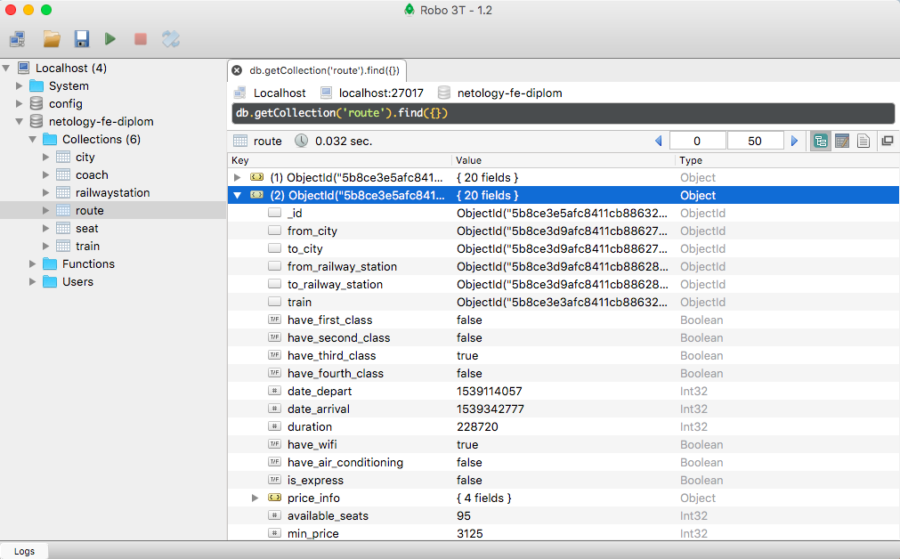

# Этап 1. Установка и настройка.

## Критерии достижения

1. Вы имеете актуальный код данного репозитория на рабочем компьютере;
2. Вы установили MongoDB и создали базу данных
3. Вы запустили скрипт заполнения базы данных случайной информацией
4. Вы проверили, что в базу данные попали

## Необходимые инструменты

1. Система контроля версий git
2. Аккаунт на Github
3. Установленный локально (на вашем компьютере) NodeJS.
4. Установленный локально сервер базы данных MongoDB

## Установка MongoDB и создание базы данных

Установка сервера баз данных MongoDB на разных операционных системах отличается.

1. [Windows](https://metanit.com/nosql/mongodb/1.2.php)
2. [Официальное руководство по всем ОС](https://docs.mongodb.com/manual/administration/install-community/)


## Порядок выполнения

1. Создайте копию данного проекта, нажав кнопку Fork в 
правом верхнем углу этой страницы
2. Клонируйте репозиторий командой в вашем терминале 
```git clone адрес_вашего_репозитория```
3. Установите все необходимые пакеты проекта командой 
```npm i``` или ```yarn install``` (если вы предпочитаете yarn)
4. Скопируйте файл ```backend/config.local.example.js``` в ту же папку 
(```/backend```) с именем ```config.local.js```.
Если в процессе установки БД выше вы оставили все параметры по умолчанию, можете
приступить к выполнению следующего шага. В ином случае настройте порт и 
название базы так, чтобы они были верными.
4. Внутри папки проекта запустите команду ```npm run db:seed```. Это загрузит в 
базу случайные данные о поездах, вагонах, направлениях и занятых местах.
Процесс небыстрый, проявите терпение.

## Проверка

1. Убедитесь, что в процессе выполнения задачи у вас не возникло ни одной ошибки
2. Проверьте, что база данных заполнена какими-то данными. Вполне возможно,
вам будет удобно просматривать содержимое базы какой-либо программой.
Из наиболее удобного рекомендуем обратить внимание на 
[Robo 3T](https://robomongo.org/download).
В этой программе после настройки соединения вы должны увидеть свою БД и
какое-то содержимое:

