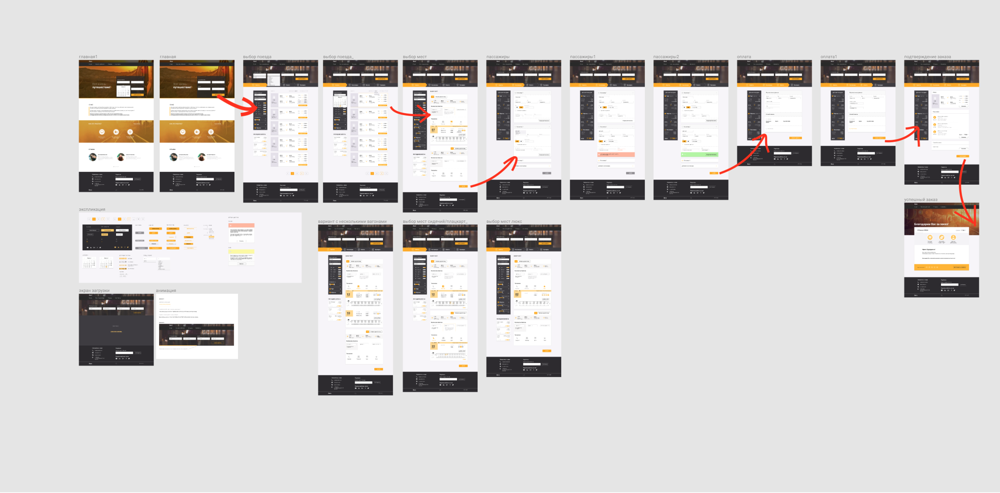

# Этап 2. Вёрстка проекта

## Критерии достижения

1. Вёрстка выполнена по всем требованиям
2. Свёрстаны все страницы

## Макет

Все макеты располагаются в сервисе Figma по 
[этой ссылке](https://www.figma.com/file/7981GjEsjSpBUKolk4xFoT/Заказ-билетов?node-id=0%3A1)

Карта переходов на экранах:

[Ссылка на изображение](./images/screens.png)

## Требования к вёрстке

1. Корректно отображается в Chrome
2. Валидные HTML и CSS
3. В наименовании CSS-классов желательно придерживаться методологии
[БЭМ](https://ru.bem.info/methodology/quick-start/)

При желании, можете на своё усмотрение сделать адаптивную версию сайта (макетов нет).

## Рекомендации

С учётом того, что далее вам потребуется разрабатывать frontend для данного
сервиса, рекомендуется подробно изучить все макеты и разрабатывать вёрстку так,
чтобы потом было легче интегрировать её в React-приложение.

## Критерии выполнения

1. Ссылки в главном меню перебрасывают на соответствующие области главной страницы
(якорные ссылки)
2. Радиокнопки и ползунки в боковом фильтре поиска направлений 
свёрстаны, и вам будет удобно их переносить в React-приложение
3. У вас имеется 3 состояния для кнопок: обычное, hover и active
